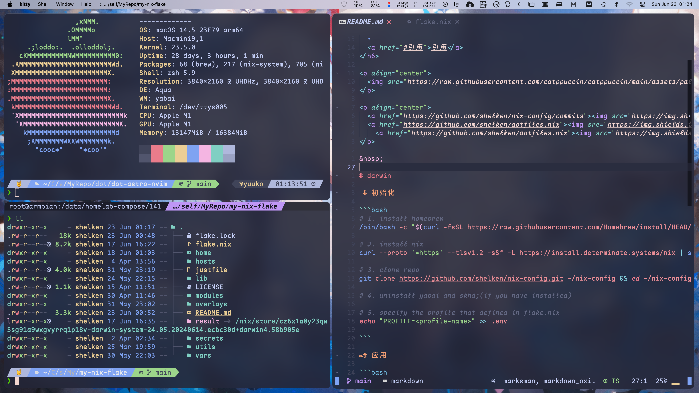

<h3 align="center">
  <br/>
  
   NixOS Config for <a href="https://github.com/shelken">Shelken</a>
  
</h3>

<h6 align="center">
  <a href="#darwin">Darwin</a>
  ·
  <a href="#部署">部署</a>
  ·
  <a href="#引用">引用</a>
</h6>

<p align="center">
  
</p>

<p align="center">
  <a href="https://github.com/shelken/nix-config/commits"></a>
  <a href="https://github.com/shelken/dotfiles.nix"></a>
    <a href="https://github.com/shelken/dotfiles.nix"></a>
</p>

&nbsp;

# darwin



## 初始化

```bash
# 1. install homebrew
/bin/bash -c "$(curl -fsSL https://raw.githubusercontent.com/Homebrew/install/HEAD/install.sh)"

# 2. install nix
curl --proto '=https' --tlsv1.2 -sSf -L https://install.determinate.systems/nix | sh -s -- install

# 3. clone repo
git clone https://github.com/shelken/nix-config.git ~/nix-config && cd ~/nix-config

# 4. uninstall yabai and skhd;(if you have installed)

# 5. specify the profile that defined in flake.nix
echo "PROFILE=<profile-name>" >> .env

```

## 应用

```bash

# before run, you should have just. `brew install just`
# switch
just switch

# only build result
just b

```

## 卸载

```bash

# uninstall nix
/nix/nix-installer uninstall

```

## 常见问题

### font 文件 一直在等lock

解决：`sudo rm -rf /nix/store/**.lock`

### wezterm 在 mac 上颜色显示错误

尝试在`wezterm.lua`中配置`front_end = "WebGpu"`。

# 部署

> 在本地部署其他机器

## example

```bash
# 1 deploy pve156 config on host(pve156)
just deploy pve156 shelken@pve156
# 2
just deploy pve156 shelken@192.168.6.156
```

# 引用

> 配置参考来源

- [ryan4yin's nix-config](https://github.com/ryan4yin/nix-config) `*`主要配置来源
- [khaneliman/khanelinix](https://github.com/khaneliman/khanelinix) `*`使用 Snowfall 感觉不错
- [catppuccin/catppuccin](https://github.com/catppuccin/catppuccin) `*`主题配色
- [Home Manager Options](https://home-manager-options.extranix.com)
- [Nix Darwin Configuration Options](https://daiderd.com/nix-darwin/manual/index.html)
- [NixOS Packages Search](https://search.nixos.org/packages)
- [NixOS Options Search](https://search.nixos.org/options)
- [NixOS 与 Flakes 一份非官方的新手指南](https://nixos-and-flakes.thiscute.world/zh) `*`中文教程
