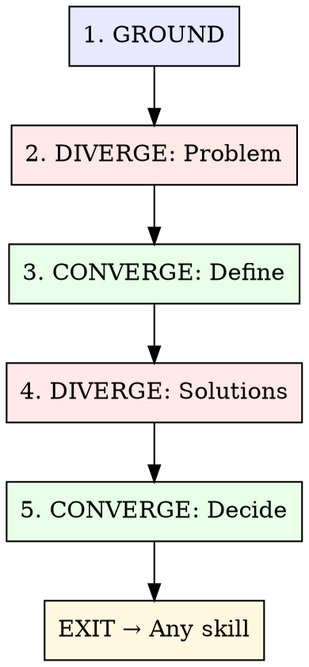

# Collaborative Brainstorming

用 Double Diamond 模型做结构化发散，结合持久记忆。

**Core insight:**
AI 在发散阶段更擅长产出数量和跨领域连接。人类在收敛阶段更擅长判断和取舍。这个技能把两类阶段拆开，并用 Hindsight 作为长期记忆，避免重复探索已有结论。

## The Process



---

## Phase 1: GROUND (Memory-First)

**先搜已有信息，再产出新想法。**

### Actions

1. **搜索 Hindsight**，找相关模式、历史决策、已知约束：
   - `hindsight-embed memory recall default "<topic keywords>"` — 查全局记忆
   - `hindsight-embed memory recall project-[name] "<related architecture>"` — 查项目记忆
   - 如项目没有独立 bank，使用 `default`

2. **整理约束条件** — 哪些内容已经定下？哪些是刚性条件？
   - 技术栈是否固定？预算是否受限？时间是否受限？
   - 现有模式里哪些必须延续？

3. **展示历史依据** — 在发散前先给用户看 Hindsight 里已有结论：

   ```text
   Hindsight 里有 3 条相关记录：模式 X、决策 Z、注意点 W。要纳入本次讨论吗？
   ```

### Gate

如果 Hindsight 里已有可直接复用的模式或决策，先展示再进入发散。

---

## Phase 2: DIVERGE — Explore the Problem Space

**Goal:** 先拉宽范围，确认真正要解决的问题。

### Actions

1. **一次只问一个问题**，逐步理解目标：
   - 当前痛点在哪里？
   - 谁会受益？他们现在怎么处理？
   - 成功的结果长什么样？

2. **从多个角度重述问题：**
   - 用户视角："As a [user], I need..."
   - 系统视角："The system currently..."
   - 约束视角："We're bounded by..."

3. **当问题空间很大时**，并行派发 Explore agents：
   ```
   Agent 1: 调研类似项目如何处理这个问题
   Agent 2: 映射当前代码库涉及范围
   Agent 3: 搜索 SOTA approaches (WebSearch)
   ```

### Anti-patterns

- 这一阶段聚焦问题定义。
- 每次提问保持单一重点。
- 输入即使粗粒度也可用，先帮助用户具体化。

---

## Phase 3: CONVERGE — Define the Core Problem

**Goal:** 从探索内容收敛到清晰问题定义。

### Actions

1. **综合提炼**为 1-2 句问题陈述
2. **向用户确认**："Is this what we're solving?"
3. **明确范围边界** — 哪些在范围内，哪些在范围外

### Output

> **Problem:** [清晰陈述] **In scope:** [本次覆盖内容] **Out of scope:** [本次排除内容] **Key
> constraint:** [最关键限制条件]

---

## Phase 4: DIVERGE — Explore Solutions

**Goal:** 生成多个可行方案，用数量提升质量。

### Actions

1. **给出 2-3 个方案**，并标明取舍：

   | Approach  | Pros | Cons | Complexity   | Risk |
   | --------- | ---- | ---- | ------------ | ---- |
   | A: [name] | ...  | ...  | Low/Med/High | ...  |
   | B: [name] | ...  | ...  | Low/Med/High | ...  |
   | C: [name] | ...  | ...  | Low/Med/High | ...  |

2. **加入至少一个非常规选项**，避免路径固化

3. **对齐现有模式：**
   - "这个方案沿用了 [project X] 的模式"
   - "这个方案偏离现有约定，原因是 [reason]"

4. **每个方案都写清验证方式：**
   - 如何确认方案有效？（Test？Benchmark？Visual check？）

### Exploration vs Exploitation

像 MCTS 一样平衡探索与利用，保持方案多样性：

- 方案都很相似时，加入 **wild card** 选项
- 方案差异明显时，继续保留这种发散状态
- 用户提前偏向某方案时，先补充 contrarian case 再收敛

### Anti-patterns

- 方案数量保持 2-3 个。
- 每个方案都附带取舍说明。
- 方案满足 Phase 1 已知约束。
- 从简单方案起步，复杂度按证据递增。

---

## Phase 5: CONVERGE — Decide and Record

**Goal:** 确认方案，记录决策，进入执行。

### Actions

1. **由用户选择。** 给出建议，同时保留用户最终决策权。

2. **把决策记录到 Hindsight：**

   ```
   hindsight-embed memory retain project-[name] "头脑风暴：[主题]。选择：[方案]。原因：[理由]。未选择的方案：[其他方案]，原因：[取舍]。关键约束：[X]。"
   ```

   写入内容必须使用中文；没有项目独立 bank 时使用 `default`。

3. **定义下一步动作** — brainstorm 可以进入任意合适流程：

   | Next Step                  | When                      |
   | -------------------------- | ------------------------- |
   | `/hyperskills-plan`        | 功能复杂，需要拆分任务    |
   | `/hyperskills-research`    | 需要先做更深入调研        |
   | `/hyperskills-orchestrate` | 方案已定，可以派发 agents |
   | Direct implementation      | 范围小，可直接实现        |
   | Write a spec               | 需要形成正式文档          |

### Output

> **Decision:** [本次决策] **Approach:** [选择的方案与简述] **Why:** [1-2 句理由] **Next:**
> [立即执行动作]

---

## Quick Mode

适用于小决策场景，完整 diamond 可简化：

1. 搜索 Hindsight（固定步骤）
2. 提供 2 个带取舍的方案（跳过问题发散）
3. 做出决策并记录

**Use quick mode when:** 问题已明确，用户只需要在已知方案中完成选择。

---

## Multi-Agent Brainstorming

复杂架构决策可用 **Council pattern：**

```
Agent 1 (Advocate): 为方案 A 构建最强支持论证
Agent 2 (Advocate): 为方案 B 构建最强支持论证
Agent 3 (Critic): 同时识别 A/B 两个方案的缺陷
```

综合多方输出后，再向用户提交统一分析。

**When to use:** 影响 3+ 个系统的架构决策、技术选型、重大重构。简单功能设计场景保持轻量流程。

---

## Anti-Patterns

| Anti-Pattern                              | Fix                               |
| ----------------------------------------- | --------------------------------- |
| Jumping to solutions before defining pain | 先做一轮问题框定，再进入方案发散  |
| Asking a stack of questions at once       | 每次只问一个关键问题，按反馈调整  |
| Presenting seven "maybe" options          | 给出 2-3 个真实可选项，并写清取舍 |
| Ignoring prior decisions in Hindsight     | 先查记忆，再呈现相关上下文        |
| Brainstorming when the user said build it | 用户要直接实现时，进入执行流程    |

---

## What This Skill is NOT

- **Not a gate.** You don't need permission to skip phases. If the user says "just build it," build
  it.
- **Not a waterfall.** Phases can revisit. New information in Phase 4 can send you back to Phase 2.
- **Not a document generator.** The output is a decision, not a design doc (unless the user wants
  one).
- **Not required for everything.** Bug fixes, typo corrections, and clear-spec features don't need
  brainstorming.

## YAGNI Check

收尾前检查：**"Is there anything in this plan we don't actually need yet?"**
删除冗余内容，保留能验证方案的最小实现。
