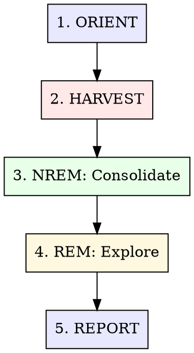

# Dream: Conversation Review & Knowledge Consolidation

Bio-inspired two-phase sleep cycle that reviews Claude Code and Codex conversations, extracts
structured knowledge, and consolidates it into Sibyl. Like biological dreaming — NREM consolidates,
REM discovers.

**Core insight:** Conversations contain 10x more knowledge than what gets manually captured. Dreams
extract decisions, patterns, corrections, anti-patterns, and open questions that would otherwise
vanish when the session scrolls off.

## The Process



### Depth Modes

| Mode           | Sessions             | Focus                         | When                       |
| -------------- | -------------------- | ----------------------------- | -------------------------- |
| **Quick nap**  | Last 1-3             | Extract from today's work     | End of day, `/dream quick` |
| **Full sleep** | Last 5-15            | Standard consolidation cycle  | Default `/dream`           |
| **Deep sleep** | All since last dream | Cross-project synthesis + REM | `/dream deep`              |
| **Lucid**      | Specific session(s)  | Targeted extraction           | `/dream <session-id>`      |

---

## Phase 1: ORIENT

**Understand the dream landscape before processing.**

### Actions

1. **Check dream state** — when was the last dream cycle?

   ```bash
   # Check Claude's auto-dream lock
   stat ~/.claude/projects/*/memory/.consolidate-lock 2>/dev/null | grep -A1 "Modify"

   # Check Sibyl for recent dream entries
   sibyl search "dream report" --type episode --limit 3
   ```

2. **Discover conversation sources:**

   **Claude Code sessions:**

   ```bash
   # Find recent sessions across ALL projects (last 7 days)
   find ~/.claude/projects -name "*.jsonl" -not -path "*/subagents/*" -mtime -7 -exec ls -lt {} + | head -30
   ```

   **Codex sessions:**

   ```bash
   # Find recent Codex rollouts
   find ~/.codex/sessions -name "rollout-*.jsonl" -mtime -7 -exec ls -lt {} + | head -30
   ```

3. **Count the harvest:**
   - How many sessions since last dream?
   - Which projects were active?
   - Any notably long or complex sessions? (file size > 100KB = rich conversation)

4. **Set dream scope** based on depth mode and available sessions.

---

## Phase 2: HARVEST

**Read conversations and identify extractable knowledge.**

### Reading Claude Code Sessions

Claude Code JSONL files contain one JSON object per line. Key message types to look for:

| Content Type                | Where to Find                            | What to Extract                      |
| --------------------------- | ---------------------------------------- | ------------------------------------ |
| **User corrections**        | User messages following assistant errors | Anti-patterns, wrong assumptions     |
| **Technical decisions**     | Assistant text blocks with rationale     | Decision + alternatives considered   |
| **Tool invocations**        | `tool_use` blocks (Bash, Edit, etc.)     | Commands that worked, error patterns |
| **Debugging chains**        | Sequences of failed → fixed attempts     | Error patterns, root causes          |
| **Architecture discussion** | Longer text blocks with design reasoning | Patterns, system relationships       |
| **Thinking blocks**         | `type: "thinking"` content               | Reasoning chains, hidden insights    |

**Extraction strategy — don't read whole files.** Use targeted python extraction:

```bash
# Extract all user prompts (most reliable method)
python3 -c "
import json, sys
with open('session.jsonl') as f:
    for line in f:
        obj = json.loads(line)
        if obj.get('type') == 'user':
            content = obj.get('message', {}).get('content', '')
            if isinstance(content, str) and len(content) > 20 and not content.startswith('<'):
                print(content[:300])
"

# Extract assistant decisions and rationale
python3 -c "
import json
with open('session.jsonl') as f:
    for line in f:
        obj = json.loads(line)
        if obj.get('type') == 'assistant':
            for block in obj.get('message', {}).get('content', []):
                if isinstance(block, dict) and block.get('type') == 'text':
                    text = block['text']
                    if any(kw in text.lower() for kw in ['because', 'root cause', 'the issue', 'approach', 'trade-off']):
                        if len(text) > 100:
                            print(text[:400])
                            print('---')
"

# Get session titles (best way to understand session topics at a glance)
for f in ~/.claude/projects/-Users-bliss-dev-*/*.jsonl; do
  title=\$(grep -m1 '"ai-title"' "\$f" 2>/dev/null | python3 -c "import sys,json; print(json.loads(next(sys.stdin)).get('aiTitle',''))" 2>/dev/null)
  [[ -n "\$title" ]] && echo "\$(du -h "\$f" | cut -f1)  \$(basename "\$(dirname "\$f")"): \$title"
done | sort -rh | head -20
```

**Why python over grep:** Claude Code JSONL has nested JSON structures (content arrays inside
message objects). Simple grep patterns like `'"role":"user"'` match across the entire line,
producing false positives from assistant messages that quote user content. Python parsing is slower
but precise. Use grep only for initial signal scoring (counts), then python for actual extraction.

For promising sessions (high correction count, long duration, many tool calls), read key segments
more deeply using `Read` tool on the JSONL file with offset/limit.

### Reading Codex Sessions

Codex rollouts at `~/.codex/sessions/YYYY/MM/DD/rollout-*.jsonl` use a different format. See
`references/conversation-formats.md` for the full schema.

```bash
# Find Codex sessions with substantial content
find ~/.codex/sessions -name "rollout-*.jsonl" -mtime -7 -size +10k

# Get Codex session metadata (cwd, branch, model)
python3 -c "
import json
with open('rollout.jsonl') as f:
    for line in f:
        obj = json.loads(line)
        if obj.get('type') == 'session_meta':
            p = obj['payload']
            print(f'cwd: {p.get(\"cwd\")}')
            print(f'model: {p.get(\"model_provider\")}')
            print(f'branch: {p.get(\"git\", {}).get(\"branch\")}')
            break
"

# Extract user messages from Codex (payload.role == 'user')
python3 -c "
import json
with open('rollout.jsonl') as f:
    for line in f:
        obj = json.loads(line)
        if obj.get('type') == 'response_item':
            p = obj.get('payload', {})
            if p.get('role') == 'user':
                for c in p.get('content', []):
                    if c.get('type') == 'input_text':
                        text = c['text']
                        if not text.startswith('#') and not text.startswith('<') and len(text) > 20:
                            print(text[:200])
"

# Extract function calls
grep '"function_call"' rollout.jsonl | grep -v '"function_call_output"'
```

### Signal Scoring

Prioritize sessions for deep reading:

| Signal                         | Score | How to Detect                                  |
| ------------------------------ | ----- | ---------------------------------------------- |
| User corrections present       | +3    | grep for negation words in user messages       |
| Multiple error-fix cycles      | +2    | tool_use errors followed by successful retries |
| Long session (>50 messages)    | +1    | line count of JSONL                            |
| Cross-project references       | +2    | mentions of other project paths                |
| Architecture/design discussion | +2    | grep for design keywords                       |
| New library/tool adoption      | +2    | grep for "install", "add", package names       |
| Simple Q&A session             | -1    | Short session with no tool calls               |

**Process top-scored sessions first.** For quick nap mode, only process the top 3.

---

## Phase 3: NREM — Structured Consolidation

**Transform raw conversation signal into structured Sibyl entities.**

### Extraction Categories

For each significant finding, classify and write to Sibyl:

#### 1. Decisions (→ Sibyl `episode` with category `decision`)

```bash
sibyl add "Decision: [what was decided]" \
  "[rationale]. Alternatives considered: [list]. Context: [project/feature]. Date: [date]." \
  --type episode --category decision --tags "project:[name]"
```

**What qualifies:** Any technical choice with trade-offs — library selection, architecture pattern,
API design, configuration approach.

#### 2. Patterns (→ Sibyl `pattern`)

```bash
sibyl add "Pattern: [name]" \
  "[description]. When to use: [context]. Example: [brief code/approach]. Discovered in: [project]." \
  --type pattern --category "[domain]" --tags "project:[name]" --languages "[lang]"
```

**What qualifies:** Reusable approaches that worked well. The bar: would this be useful in a
different project?

#### 3. Corrections / Anti-Patterns (→ Sibyl `error_pattern`)

```bash
sibyl add "Anti-pattern: [what went wrong]" \
  "Wrong approach: [what was tried]. Why it failed: [root cause]. Correct approach: [what worked]. Context: [project]." \
  --type error_pattern --category "[domain]" --tags "project:[name]"
```

**What qualifies:** Mistakes that were corrected. The user said "no" or "that's wrong" or something
broke and was debugged.

#### 4. Rules (→ Sibyl `rule`)

```bash
sibyl add "Rule: [the rule]" \
  "[explanation]. Why: [rationale]. Applies to: [scope]. Discovered: [date]." \
  --type rule --category "[domain]" --tags "project:[name]"
```

**What qualifies:** Hard constraints discovered through experience. "Always X when Y." "Never Z
because W."

#### 5. Open Questions / Tensions (→ Sibyl `episode` with category `tension`)

```bash
sibyl add "Tension: [the unresolved question]" \
  "Context: [what prompted this]. Options considered: [list]. Blocking: [what it blocks]. Needs: [what would resolve it]." \
  --type episode --category tension --tags "project:[name]"
```

**What qualifies:** Questions that were raised but not answered. Contradictions between approaches.
Deferred decisions.

### Deduplication

**Before writing ANY entity to Sibyl, check for existing similar entries:**

```bash
sibyl search "[entity title keywords]" --type [type] --limit 5
```

| Finding                 | Action                                                      |
| ----------------------- | ----------------------------------------------------------- |
| No similar entries      | Create new entity                                           |
| Similar but older entry | Update existing if new info supersedes, or add relationship |
| Exact duplicate         | Skip — log in dream report                                  |
| Contradictory entry     | Create tension entity linking both                          |

### Batch Processing

For efficiency, accumulate extractions and write them in batches:

1. Read and extract from all harvested sessions
2. Deduplicate the extraction set itself (multiple sessions may contain the same insight)
3. Check each against Sibyl
4. Write new entities
5. Track what was written for the dream report

---

## Phase 4: REM — Creative Exploration

**Only in `deep` mode. Find unexpected connections across projects.**

### Cross-Project Pattern Detection

```bash
# What patterns exist across multiple projects?
sibyl explore --type pattern --limit 50

# What error patterns keep recurring?
sibyl explore --type error_pattern --limit 30

# What tensions are unresolved?
sibyl search "tension" --type episode --limit 20
```

### Connection Discovery

Look for:

1. **Pattern reuse:** A pattern from project A that would solve a problem in project B
2. **Contradictory approaches:** Project A does X one way, project B does it differently — which is
   right?
3. **Shared infrastructure gaps:** Multiple projects hitting the same limitation
4. **Knowledge transfer:** Something learned in one domain that applies to another

For each discovered connection:

```bash
# Record the cross-project insight
sibyl add "Cross-project: [insight]" \
  "[description]. Connects: [project A] and [project B]. Implication: [what to do about it]." \
  --type episode --category cross-project --tags "project:[A],project:[B]"
```

### Staleness Detection

```bash
# Find old entities that may be outdated
sibyl explore --type pattern,rule --limit 100
```

For each entity older than 90 days:

- Is the project still active? (check git log)
- Has the technology changed? (check versions)
- Does the pattern still apply? (check current code)

Mark stale entities:

```bash
sibyl entity update <entity-id> --tags "stale,needs-review"
```

### Importance Decay

Score existing entities by: `base_importance * recency_factor * reference_count`

- Entities referenced in recent sessions → boost
- Entities not referenced in 60+ days → flag for review
- Entities contradicted by newer findings → mark as superseded

---

## Phase 5: REPORT

**Generate a dream summary and record the dream cycle.**

### Dream Report Structure

```markdown
## Dream Report — [date]

### Sessions Reviewed

- [count] Claude Code sessions across [count] projects
- [count] Codex sessions
- Time span: [earliest] to [latest]
- Projects: [list]

### Knowledge Extracted

- **[N] decisions** recorded
- **[N] patterns** discovered/updated
- **[N] anti-patterns** captured
- **[N] rules** established
- **[N] tensions** identified

### Highlights

1. [Most significant finding — 1-2 sentences]
2. [Second most significant]
3. [Third most significant]

### Cross-Project Insights (deep mode only)

- [Connection discovered between projects]
- [Pattern that applies more broadly than originally thought]

### Stale Knowledge Flagged

- [Entity that may need review]

### Dream Metrics

- Sessions processed: [N]
- Entities created: [N]
- Entities updated: [N]
- Duplicates skipped: [N]
- Sibyl calls: [N]
```

### Record the Dream

```bash
# Record the dream cycle itself
sibyl add "Dream Report: [date]" \
  "[full dream report content]" \
  --type episode --category dream-report --tags "dream,maintenance"
```

### Update Memory Files (Optional)

If significant learnings should be immediately available to Claude Code sessions (not just via Sibyl
search), write key findings to the relevant project's memory:

```bash
# Only for high-impact findings that affect session behavior
# Most knowledge should live in Sibyl, not flat files
```

---

## Quick Nap Mode

For fast end-of-day processing:

1. Find today's sessions (Claude + Codex)
2. Grep for corrections and errors only
3. Extract the top 3-5 findings
4. Write to Sibyl
5. One-paragraph dream report

**Skip:** REM phase, staleness detection, cross-project analysis, memory file updates.

---

## Integration Notes

### Sibyl Is the Primary Store

Everything goes to Sibyl — not memory/\*.md files. Sibyl provides:

- Semantic search (vector + BM25)
- Relationship modeling (entity connections)
- Temporal awareness (when things were learned)
- Cross-project visibility (shared graph)
- Multi-machine access (network service)

Memory files are only updated for critical session-level behaviors that need to be in Claude Code's
native context window.

### Conversation Formats

See `references/conversation-formats.md` for:

- Claude Code JSONL schema (TranscriptMessage types, content blocks)
- Codex rollout JSONL schema (session_meta, response_item, event_msg, turn_context)
- Useful grep patterns for each format

### Extraction Quality

See `references/extraction-guide.md` for:

- What makes a good vs bad extraction
- Sibyl entity type selection guide
- Deduplication strategies
- Examples of high-quality dream extractions

---

## Anti-Patterns

| Anti-Pattern                             | Fix                                                                   |
| ---------------------------------------- | --------------------------------------------------------------------- |
| Reading entire JSONL files               | Grep first, read targeted segments                                    |
| Extracting trivial Q&A                   | Only extract non-obvious insights with transfer value                 |
| Writing to memory/\*.md instead of Sibyl | Sibyl is the primary store — memory files are a narrow exception      |
| Skipping dedup check                     | Always search Sibyl before writing — duplicates degrade graph quality |
| Dream without orient                     | Always check when last dream ran — avoid re-processing                |
| Extracting everything from every session | Score sessions first, process high-signal ones deeply                 |
| Ignoring Codex sessions                  | Codex conversations contain valuable engineering knowledge too        |

---

## What This Skill is NOT

- **Not a replacement for Auto Dream.** Auto Dream manages memory/\*.md housekeeping. This skill
  extracts knowledge into Sibyl.
- **Not real-time.** Dreams process past conversations. For live knowledge capture, use `sibyl add`
  directly during sessions.
- **Not a full conversation replay.** We extract signal, not transcripts. Sibyl stores insights, not
  chat logs.
- **Not automatic (yet).** Invoke with `/dream`. Future: SessionEnd hook for automatic NREM
  processing.
