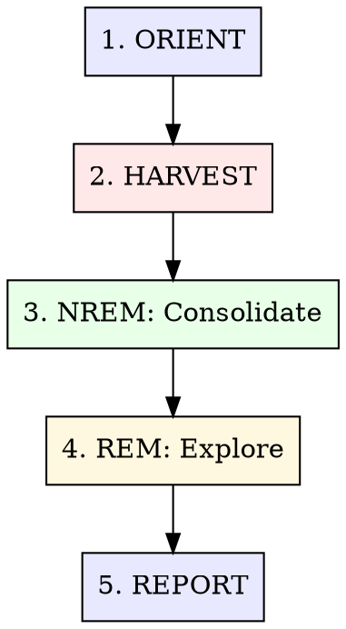

# Dream: Conversation Review & Knowledge Consolidation

受生物睡眠启发的两阶段回顾流程，用于审阅 Pi、Claude
Code 和 Codex 对话，提取可复用知识，并整理进 Hindsight。类似生物梦境：NREM 负责巩固，REM 负责发现。

**Core insight:**
对话里包含的知识远多于手动记录。Dream 会提取决策、模式、修正、反模式和开放问题，避免这些信息随会话滚动而消失。

## The Process



### Depth Modes

| 模式           | 会话范围            | 重点               | 使用时机                          |
| -------------- | ------------------- | ------------------ | --------------------------------- |
| **Quick nap**  | 最近 1-3 个         | 从当天工作提取内容 | 日末，`/hyperskills-dream quick`  |
| **Full sleep** | 最近 5-15 个        | 标准巩固周期       | 默认 `/hyperskills-dream`         |
| **Deep sleep** | 上次 dream 后的全部 | 跨项目综合 + REM   | `/hyperskills-dream deep`         |
| **Lucid**      | 指定会话            | 定向提取           | `/hyperskills-dream <session-id>` |

---

## Phase 1: ORIENT

**处理前先了解 dream 范围。**

### Actions

1. **检查 dream 状态**：上一次 dream cycle 是什么时候？

   ```bash
   # Check Hindsight for recent dream entries
   hindsight-embed memory recall project-[name] "梦境报告"
   hindsight-embed memory recall default "梦境报告"

   # Optional: if Claude Code sessions are included, check its auto-dream lock
   stat ~/.claude/projects/*/memory/.consolidate-lock 2>/dev/null | grep -A1 "Modify"
   ```

2. **发现对话来源：**

   **Pi sessions（主来源）:**

   ```bash
   # Find recent Pi sessions across ALL projects (last 7 days)
   find ~/.pi/agent/sessions -name "*.jsonl" -mtime -7 -exec ls -lt {} + | head -30
   ```

   **Claude Code sessions（辅助来源）:**

   ```bash
   # Find recent Claude Code sessions across ALL projects (last 7 days)
   find ~/.claude/projects -name "*.jsonl" -not -path "*/subagents/*" -mtime -7 -exec ls -lt {} + | head -30
   ```

   **Codex sessions（辅助来源）:**

   ```bash
   # Find recent Codex rollouts
   find ~/.codex/sessions -name "rollout-*.jsonl" -mtime -7 -exec ls -lt {} + | head -30
   ```

3. **统计可收割内容：**
   - 上次 dream 后有多少会话？
   - 哪些项目活跃？
   - 是否存在很长或很复杂的会话？（文件大小 > 100KB = 信息密度高）

4. **根据 depth mode 和可用会话设置 dream 范围。**

---

## Phase 2: HARVEST

**阅读对话，识别可提取知识。**

**Reading Pi Sessions**

Pi sessions 位于 `~/.pi/agent/sessions/`，是当前主力编程会话来源。优先处理 Pi，再处理 Claude
Code 和 Codex。

```bash
# Find Pi sessions with substantial content
find ~/.pi/agent/sessions -name "*.jsonl" -mtime -7 -size +10k -exec ls -lt {} + | head -30

# Extract user messages from Pi sessions
python3 -c "
import json
with open('session.jsonl') as f:
    for line in f:
        obj = json.loads(line)
        text = str(obj)
        if 'user' in text.lower() and len(text) > 80:
            print(text[:300])
            print('---')
"
```

Pi session
schema 会随 pi 版本变化。先用 Python 解析 JSONL，再按真实字段提取 user、assistant、tool 调用和错误信息。

### Reading Claude Code Sessions

Claude Code JSONL 文件每行包含一个 JSON 对象。重点关注以下消息类型：

| 内容类型            | 查找位置                       | 提取内容                |
| ------------------- | ------------------------------ | ----------------------- |
| **用户修正**        | assistant 出错后的 user 消息   | 反模式、错误假设        |
| **技术决策**        | 带理由的 assistant 文本块      | 决策 + 曾考虑的替代方案 |
| **工具调用**        | `tool_use` 块（Bash、Edit 等） | 有效命令、错误模式      |
| **调试链路**        | 失败 → 修复的连续尝试          | 错误模式、问题原因      |
| **架构讨论**        | 带设计推理的较长文本块         | 模式、系统关系          |
| **Thinking blocks** | `type: "thinking"` 内容        | 推理链、隐藏洞察        |

**提取策略 — 不要整文件阅读。** 使用定向 python 提取：

```bash
# Extract all user prompts (most reliable method)
python3 -c "
import json, sys
with open('session.jsonl') as f:
    for line in f:
        obj = json.loads(line)
        if obj.get('type') == 'user':
            content = obj.get('message', {}).get('content', '')
            if isinstance(content, str) and len(content) > 20 and not content.startswith('<'):
                print(content[:300])
"

# Extract assistant decisions and rationale
python3 -c "
import json
with open('session.jsonl') as f:
    for line in f:
        obj = json.loads(line)
        if obj.get('type') == 'assistant':
            for block in obj.get('message', {}).get('content', []):
                if isinstance(block, dict) and block.get('type') == 'text':
                    text = block['text']
                    if any(kw in text.lower() for kw in ['because', 'root cause', 'the issue', 'approach', 'trade-off']):
                        if len(text) > 100:
                            print(text[:400])
                            print('---')
"

# Get session titles (best way to understand session topics at a glance)
for f in ~/.claude/projects/-Users-bliss-dev-*/*.jsonl; do
  title=\$(grep -m1 '"ai-title"' "\$f" 2>/dev/null | python3 -c "import sys,json; print(json.loads(next(sys.stdin)).get('aiTitle',''))" 2>/dev/null)
  [[ -n "\$title" ]] && echo "\$(du -h "\$f" | cut -f1)  \$(basename "\$(dirname "\$f")"): \$title"
done | sort -rh | head -20
```

**为什么用 python 而不是 grep：** Claude Code
JSONL 里有嵌套 JSON 结构（message 对象里的 content 数组）。像 `"role":"user"`
这样的简单 grep 会匹配整行，容易把 assistant 消息里引用的 user 内容也算进去。Python 解析更慢，但更准确。grep 只用于初步信号评分，真正提取时用 python。

对高价值会话（修正多、时长长、工具调用多），使用 `Read` tool 通过 offset/limit 深入阅读关键片段。

### Reading Codex Sessions

Codex rollout 位于 `~/.codex/sessions/YYYY/MM/DD/rollout-*.jsonl`，格式不同。按当前 JSONL 字段解析。

```bash
# Find Codex sessions with substantial content
find ~/.codex/sessions -name "rollout-*.jsonl" -mtime -7 -size +10k

# Get Codex session metadata (cwd, branch, model)
python3 -c "
import json
with open('rollout.jsonl') as f:
    for line in f:
        obj = json.loads(line)
        if obj.get('type') == 'session_meta':
            p = obj['payload']
            print(f'cwd: {p.get("cwd")}')
            print(f'model: {p.get("model_provider")}')
            print(f'branch: {p.get("git", {}).get("branch")}')
            break
"

# Extract user messages from Codex (payload.role == 'user')
python3 -c "
import json
with open('rollout.jsonl') as f:
    for line in f:
        obj = json.loads(line)
        if obj.get('type') == 'response_item':
            p = obj.get('payload', {})
            if p.get('role') == 'user':
                for c in p.get('content', []):
                    if c.get('type') == 'input_text':
                        text = c['text']
                        if not text.startswith('#') and not text.startswith('<') and len(text) > 20:
                            print(text[:200])
"

# Extract function calls
grep '"function_call"' rollout.jsonl | grep -v '"function_call_output"'
```

### Signal Scoring

优先深入阅读高分会话：

| 信号                 | 分数 | 检测方式                    |
| -------------------- | ---- | --------------------------- |
| 有用户修正           | +3   | 在 user 消息里 grep 否定词  |
| 多次 error-fix 循环  | +2   | tool_use 错误后出现成功重试 |
| 长会话（>50 条消息） | +1   | JSONL 行数                  |
| 跨项目引用           | +2   | 提到其他项目路径            |
| 架构/设计讨论        | +2   | grep 设计关键词             |
| 新库/新工具引入      | +2   | grep "install"、"add"、包名 |
| 简单问答会话         | -1   | 短会话且无工具调用          |

**先处理分数最高的会话。** Quick nap mode 只处理前 3 个。

---

## Phase 3: NREM — Structured Consolidation

**把原始对话信号转成 Hindsight 可吸收的中文记忆。**

### Extraction Categories

对每个重要发现分类，并用中文写入 Hindsight：

#### 1. Decisions

```bash
hindsight-embed memory retain project-[name] "决策：[决策内容]。理由：[理由]。曾考虑方案：[候选项]。上下文：[项目/功能]。日期：[date]。"
```

**什么符合条件：** 带有取舍的技术选择，例如库选型、架构模式、API 设计、配置方式。

#### 2. Patterns

```bash
hindsight-embed memory retain project-[name] "模式：[名称]。描述：[描述]。适用场景：[上下文]。示例：[简短代码或做法]。发现项目：[项目]。"
```

**什么符合条件：** 可复用且效果好的方法。判断标准：换到另一个项目里是否仍有价值。

#### 3. Corrections / Anti-Patterns

```bash
hindsight-embed memory retain project-[name] "反模式：[错误做法]。错误尝试：[尝试内容]。失败原因：[原因]。正确做法：[有效方案]。上下文：[项目]。"
```

**什么符合条件：** 被修正过的错误。用户说了 "no"、"that's wrong"，或某件事失败后被调试解决。

#### 4. Rules

```bash
hindsight-embed memory retain project-[name] "规则：[规则内容]。说明：[解释]。原因：[理由]。适用范围：[范围]。发现日期：[date]。"
```

**什么符合条件：** 从经验中发现的强约束。"Always X when Y." "Never Z because W."

#### 5. Open Questions / Tensions

```bash
hindsight-embed memory retain project-[name] "待定问题：[未解决问题]。上下文：[触发原因]。已考虑选项：[候选项]。阻塞内容：[阻塞点]。需要：[解决所需信息]。"
```

**什么符合条件：** 提出后尚未回答的问题、方法之间的矛盾、推迟的决策。

所有 `retain` 内容必须使用中文；没有项目独立 bank 时使用 `default`。

### Deduplication

**向 Hindsight 写入任何记忆前，先检查是否已有相似内容：**

```bash
hindsight-embed memory recall project-[name] "[memory title keywords]"
hindsight-embed memory recall default "[memory title keywords]"
```

| 发现类型     | 操作                                     |
| ------------ | ---------------------------------------- |
| 无相似内容   | 用中文创建新记忆                         |
| 相似但更旧   | 用中文记录新事实与旧事实的差异           |
| 完全重复     | 跳过，并记录到 dream report              |
| 存在矛盾内容 | 用中文记录矛盾点、适用上下文和待确认问题 |

### Batch Processing

为提升效率，先累积提取结果，再批量写入：

1. 从所有 harvested sessions 中读取并提取
2. 对提取集合本身去重（多个会话可能包含相同洞察）
3. 逐条与 Hindsight recall 结果比对
4. 用中文写入新记忆
5. 追踪写入内容，用于 dream report

---

## Phase 4: REM — Creative Exploration

**仅在 `deep` mode 使用。发现跨项目的意外连接。**

### Cross-Project Pattern Detection

```bash
# What patterns appear across multiple projects?
hindsight-embed memory recall default "跨项目 模式 复用"

# What error patterns keep recurring?
hindsight-embed memory recall default "反模式 错误 重复出现"

# What tensions are unresolved?
hindsight-embed memory recall default "待定问题 矛盾 阻塞"
```

### Connection Discovery

寻找：

1. **模式复用：** 项目 A 的模式能解决项目 B 的问题
2. **矛盾方法：** 项目 A 用一种方式，项目 B 用另一种方式；需要判断哪种更合适
3. **共享基础设施缺口：** 多个项目遇到同一限制
4. **知识迁移：** 一个领域学到的内容适用于另一个领域

每个发现的连接都记录下来：

```bash
# Record the cross-project insight
hindsight-embed memory retain default "跨项目洞察：[洞察]。描述：[描述]。连接项目：[项目 A] 与 [项目 B]。影响：[后续动作]。"
```

---

## Phase 5: REPORT

**生成 dream summary，并记录本次 dream cycle。**

### Dream Report Structure

```markdown
## Dream Report — [date]

### Sessions Reviewed

- [count] 个 Pi sessions，覆盖 [count] 个项目
- [count] 个 Claude Code sessions
- [count] 个 Codex sessions
- 时间范围：[earliest] 到 [latest]
- 项目：[list]

### Knowledge Extracted

- 记录 **[N] 个 decisions**
- 发现/更新 **[N] 个 patterns**
- 捕获 **[N] 个 anti-patterns**
- 建立 **[N] 条 rules**
- 识别 **[N] 个 tensions**

### Highlights

1. [最重要发现 — 1-2 句话]
2. [第二重要发现]
3. [第三重要发现]

### Cross-Project Insights (deep mode only)

- [项目之间发现的连接]
- [适用范围比原先更广的模式]

### Dream Metrics

- 已处理 sessions：[N]
- 新写入记忆：[N]
- 跳过重复项：[N]
- Hindsight calls：[N]
```

### Record the Dream

```bash
# Record the dream cycle itself
hindsight-embed memory retain project-[name] "梦境报告：[date]。[完整 dream report 中文内容]"
```

### Update Memory Files (Optional)

如果重要发现需要立即进入 Pi 会话上下文（而非仅通过 Hindsight
recall 获取），优先通过项目 bank 写入 Hindsight：

```bash
# Only for high-impact findings that affect session behavior
# Most knowledge should live in Hindsight, not flat files
```

---

## Quick Nap Mode

用于快速日末处理：

1. 找到当天 sessions（Pi 优先，其次 Claude Code 和 Codex）
2. 只 grep 修正和错误
3. 提取前 3-5 个发现
4. 用中文写入 Hindsight
5. 生成一段 dream report

**跳过：** REM phase、cross-project analysis、memory file updates。

---

## Integration Notes

### Hindsight Is the Primary Store

所有长期知识都进入 Hindsight，而不是 memory/\*.md 文件。Hindsight 提供：

- `retain` 写入记忆
- `recall` 检索相关记忆
- `reflect` 基于记忆生成综合回答
- bank 隔离：默认 `default`，项目独立 bank 使用 `project-[name]`

```bash
hindsight-embed bank list
hindsight-embed memory reflect project-[name] "最近 dream 提取了哪些可复用经验？"
hindsight-embed memory reflect default "哪些跨项目模式最近反复出现？"
```

所有 `retain` 内容必须使用中文。Memory
files 只用于对本地 agent 原生上下文窗口有直接影响的关键会话级行为。

### Conversation Formats

详见
`references/conversation-formats.md`。会话格式以当前 client 实际 JSONL 为准。先用 Python 解析，再按字段提取 user、assistant、tool 调用和错误信息：

- Pi session：`~/.pi/agent/sessions/`
- Claude Code session：`~/.claude/projects/`
- Codex rollout：`~/.codex/sessions/`

### Extraction Quality

详见 `references/extraction-guide.md`。高质量提取应满足：

- 内容非显而易见，换到其他会话或项目仍有价值
- 包含上下文、取舍、结果和日期
- 写入 Hindsight 前先 recall，避免重复
- `retain` 内容使用中文

---

## Anti-Patterns

| Anti-Pattern                     | Fix                                           |
| -------------------------------- | --------------------------------------------- |
| 读取整个 JSONL 文件              | 先 grep，再阅读定向片段                       |
| 提取琐碎问答                     | 只提取非显而易见且有迁移价值的洞察            |
| 写入 memory/\*.md 而非 Hindsight | Hindsight 是主要存储；memory files 是少数例外 |
| 跳过去重检查                     | 写入前总是先 recall；重复内容会降低检索质量   |
| Dream without orient             | 每次先检查上次 dream 时间，避免重复处理       |
| 从每个会话提取一切               | 先给会话评分，再深入处理高信号会话            |
| 忽略 Pi sessions                 | Pi 是当前主力编程会话来源                     |
| 忽略 Codex sessions              | Codex 对话同样包含有价值的工程知识            |

---

## What This Skill is NOT

- **Not a replacement for Auto Dream.** Auto Dream manages memory/\*.md housekeeping. This skill
  extracts knowledge into Hindsight.
- **Not real-time.** Dreams process past conversations. For live knowledge capture, use
  `hindsight-embed memory retain` directly during sessions.
- **Not a full conversation replay.** We extract signal, not transcripts. Hindsight stores insights,
  not chat logs.
- **Not automatic (yet).** Invoke with `/hyperskills-dream`. Future: SessionEnd hook for automatic
  NREM processing.
