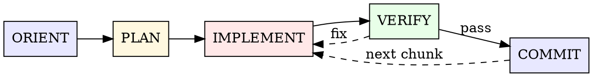

# Implementation

**Core insight:** Verify after every 2-3 edits. 73% of fixes lack verification — this is the primary
quality gap. Difference between clean sessions and debugging spirals often comes from verification
cadence.

## The Sequence

Regardless of size, every implementation follows same macro sequence:



**ORIENT** — Read existing code before changes. `Grep -> Read -> Read` is most common opening.
Sessions that read 10+ files before first edit usually need fewer later fix iterations. Avoid blind
edits.

**PLAN** — Scale-dependent (see below). Trivial fixes can skip; feature work needs task list; epic
work needs research cluster.

**IMPLEMENT** — Finish batches of 2-3 edits, then verify. Follow dependency chain. Prefer editing
existing files; ratio of existing to new files is about 9:1. Handle errors immediately; do not
accumulate them.

**VERIFY** — Typecheck is primary gate. Run after every 2-3 edits. Run tests when feature completes.
Run full test suite before commit.

**COMMIT** — Commit atomic chunks as you go. Verify, stage specific files, commit, then move to next
chunk. Typical session has multiple small commits. Message structure below in **Commit Cadence**.

---

## Code Discipline

Behavior rules across every loop phase. Adapted from Karpathy's
[observation](https://x.com/karpathy/status/2015883857489522876) on LLM coding pitfalls — models
"make wrong assumptions for you and then go off and execute without checking... they overcomplicate
code and APIs, creating bloated abstractions... 100 lines would suffice but they write 1000 lines of
bulk."

These principles favor caution over speed. Use judgment for trivial fixes.

### Think before coding

Do not assume. Do not hide confusion. State trade-offs proactively.

| Situation                            | Action                               |
| ------------------------------------ | ------------------------------------ |
| Request has multiple interpretations | Present them; do not silently choose |
| Simpler method works                 | Say it; push back when needed        |
| Something unclear                    | Stop; explain confusion; ask         |
| You hold key assumption              | State it explicitly                  |
| Request and code disagree            | Explain before continuing            |

ORIENT (reading code) is prerequisite. This principle governs what to do with findings after
reading: state gaps, do not conceal them.

### Simplicity first

Use least code that solves problem. No speculative design.

| Do not                                           | Do                                                |
| ------------------------------------------------ | ------------------------------------------------- |
| Add features beyond request                      | Solve stated problem exactly                      |
| Build abstractions for one-time code             | Inline first; abstract when reused                |
| Add unrequested "flexibility" or configurability | Keep fixed for now; parameterize when needed      |
| Handle impossible error scenarios                | Trust internal invariants; validate at boundaries |
| Write 200 lines for what could be 50             | Rewrite tighter                                   |

Test: would senior engineer call this overcomplicated? If yes, simplify.

### Surgical changes

Only change what must change. Only clean up problems you caused.

| Rule                                                       | Why                                            |
| ---------------------------------------------------------- | ---------------------------------------------- |
| Do not "improve" adjacent code, comments, or formatting    | Pollutes diff; out of scope                    |
| Do not refactor unrelated code                             | Scope creep expands blast radius               |
| Match existing style even if you would do it differently   | Local consistency beats preference             |
| Notice unrelated dead code → mention, do not delete        | Other branches/agents may depend on it         |
| Delete imports/variables/functions orphaned by your change | Clean up your own mess                         |
| Preserve existing dead code                                | Out of scope unless explicitly asked           |
| Do not touch comments you do not understand                | Karpathy: "side effects... orthogonal to task" |

Test: every changed line should trace to user request.

### Goal-driven execution

Define verifiable success criteria. Verify repeatedly until pass.

| Vague task       | Verifiable goal                                     |
| ---------------- | --------------------------------------------------- |
| "add validation" | Write tests for invalid inputs, then make them pass |
| "fix bug"        | Write test reproducing problem, then make it pass   |
| "refactor X"     | Ensure same tests pass before and after refactor    |
| "make it work"   | Ask for clear signal that proves success            |

Multi-step work needs plan with verification for each step:

```
1. [Step] → verify: [check]
2. [Step] → verify: [check]
3. [Step] → verify: [check]
```

Clear success criteria support independent iteration. Vague criteria cause repeated clarification.

---

## Scale Selection

Strategy varies heavily by scope. Choose matching weight:

| Scale                      | Edits   | Strategy                                                            |
| -------------------------- | ------- | ------------------------------------------------------------------- |
| **Trivial** (config, typo) | 1-5     | Read -> Edit -> Verify -> Commit                                    |
| **Small fix**              | 5-20    | Grep error -> Read -> Fix -> Test -> Commit                         |
| **Feature**                | 50-200  | Plan -> layered implementation -> verify each layer                 |
| **Subsystem**              | 300-500 | Task plan -> batch dispatch -> layered progress                     |
| **Epic**                   | 1000+   | Research cluster -> specification -> parallel agents -> integration |

**When to skip planning:** scope is clear, single-file change, fix can be described in one sentence.

**When to plan:** multiple files, unfamiliar code, approach still undecided.

---

## Dependency Chain

Build in this order. Verified in full-stack, Rust, and monorepo projects:

```
Types/Models -> Backend Logic -> API Routes -> Frontend Types -> Hooks/Client -> UI Components -> Tests
```

**Full-stack (Python + TypeScript):**

1. Database models + migrations
2. Service/business logic layer
3. API routes (FastAPI or tRPC)
4. Frontend API client
5. React hooks wrapping API calls
6. UI components consuming hooks
7. Lint -> typecheck -> test -> commit

**Rust:**

1. Error types (`thiserror` enums with `#[from]`)
2. Type definitions (structs, enums)
3. Core logic (`impl` blocks)
4. Module wiring (`mod.rs` re-exports)
5. `cargo check` -> `cargo clippy` -> `cargo test`

**Key finding:** Database migrations are often written after code that depends on them.
Frontend-driven backend changes happen as often as backend-driven frontend changes.

---

## Verification Cadence

This is highest-impact single practice. Get verification cadence right; rest becomes smoother.

| Gate                   | When                       | Speed               |
| ---------------------- | -------------------------- | ------------------- |
| **Typecheck**          | After every 2-3 edits      | Fast (primary gate) |
| **Lint (autofix)**     | After implementation batch | Fast                |
| **Tests (specific)**   | After feature completes    | Medium              |
| **Tests (full suite)** | Before commit              | Slow                |
| **Build**              | Only before PR/deploy      | Slowest             |

### The Edit-Verify-Fix Cycle

Best rhythm: **3 changes -> verify -> 1 fix**. Most common successful pattern.

High-cost pattern: **2 changes -> typecheck -> 15 fixes** (type cascade). Before changing shared
types, grep all consumers to prevent this.

**Combine gates to save time:** `turbo lint:fix typecheck --filter=pkg` runs both at once. Limit
verification scope to affected packages; avoid whole monorepo when unnecessary.

**Practical tips:**

- Run `lint:fix` before `lint` check to reduce iterations.
- Prefer `cargo check`; use `cargo build` less often (2-3x faster, same error detection).
- Truncate verbose output: `2>&1 | tail -20`.
- Wrap tests with timeout: `timeout 120 uv run pytest`.

---

## Decision Trees

### Read vs Edit

```
Familiar file edited earlier this session?
  Yes -> edit directly (then verify)
  No -> read it this session?
    Yes -> edit
    No -> read first (79% of quick fixes start with reading)
```

### Subagents vs Direct Work

```
Self-contained with clear deliverable?
  Yes -> produces verbose output (tests, logs, research)?
    Yes -> subagent (keep context clean)
    No -> needs frequent back-and-forth?
      Yes -> direct work
      No -> subagent
  No -> direct work (iterative improvement needs shared context)
```

### Refactoring Approach

```
Can change incrementally?
  Yes -> move first, then consolidate (separate commits)
        Keep old and new code side by side; delete old only after tests pass
  No -> analysis phase first (parallel review agents)
        Gap analysis: compare old/new implementations function by function
        Split gaps into focused tasks
```

### Bug Fix vs Feature vs Refactor

| Type         | Rhythm                                                                   | Typical loops |
| ------------ | ------------------------------------------------------------------------ | ------------- |
| **Bug fix**  | Grep error -> Read 2-5 files -> Edit 1-3 files -> Test -> Commit         | 1-2           |
| **Feature**  | Plan -> Models -> API -> Frontend -> Test -> Commit                      | 5-15          |
| **Refactor** | Audit -> Gap analysis -> Incremental migration -> Verify parity          | 10-30+        |
| **Upgrade**  | Research changelog -> Identify breaking changes -> Bump -> Fix consumers | variable      |

---

## Error Recovery

**65% of debugging sessions resolve within 1-2 iterations.** Remaining 35% can enter 6+ iteration
debugging spiral.

### Quick Resolution (Do This)

1. Read relevant code first (79% success correlation)
2. Form clear hypothesis: "Problem is X because Y"
3. Make one targeted fix
4. Verify fix worked

### Spiral Prevention (Avoid This)

1. **Separate error domains** — handle all type errors first, then test failures. Avoid
   interleaving.
2. **Three-strike rule** — after failing same error 3 times: change approach completely or escalate.
3. **Cascade depth > 3** — pause, list all remaining issues, handle in dependency order.
4. **Context decay** — after ~15-20 iterations, `/clear` and restart. Clean session with better
   prompt usually beats old session full of correction history.

### The Two-Correction Rule

If same problem has been corrected twice, run `/clear` and restart. Accumulated context noise
reduces accuracy.

---

## Commit Cadence

Commit as you go. Each commit records one built, verified, tested logical chunk. Typical session has
multiple small commits; avoid stuffing hours of unrelated work into one giant commit. COMMIT step in
macro sequence returns to IMPLEMENT for next chunk; this loop is cadence.

### When to commit

| Trigger                                                 | Action               |
| ------------------------------------------------------- | -------------------- |
| Logical chunk complete and verification passed          | Commit immediately   |
| Move/rename complete (before behavior change)           | Commit (move)        |
| Behavior change passes verification (after move commit) | Commit (change)      |
| Refactor extraction, callers still pass                 | Commit               |
| Added test covering fixed bug                           | Commit               |
| About to switch to another concern                      | Commit current chunk |
| Verification fails mid-chunk                            | Do not commit        |
| Speculative or exploratory edit                         | Do not commit        |

Rule of thumb: if reviewer would want to read it as separate diff, it should be separate commit.

### Local style first

Before first commit in any repo, check local style. Repos have their own habits — your commit should
match them.

```bash
git log -10 --oneline
```

Observe actual patterns and follow them:

| Pattern              | Example                        | How to follow        |
| -------------------- | ------------------------------ | -------------------- |
| Conventional Commits | `feat(api): add token refresh` | `type(scope): msg`   |
| Gitmoji              | `✨ Add token refresh`         | leading emoji + msg  |
| Ticket prefix        | `[ENG-1234] Add token refresh` | follow bracket style |
| Module prefix        | `auth: add token refresh`      | follow separator     |
| Plain                | `Add token refresh`            | no prefix, plain     |

**Follow format, preserve quality.** If existing commits are short one-liners, still write clear
subject and body — maintain higher standard while matching local format. If no clear pattern,
default to Conventional Commits.

### Conventional Commits (default)

Format: `type(scope): subject`. Scope optional; recommended when change scope is clear.

| Type       | When                                       |
| ---------- | ------------------------------------------ |
| `feat`     | User-facing new capability                 |
| `fix`      | Bug fix                                    |
| `refactor` | Refactor with no behavior change           |
| `perf`     | Performance optimization                   |
| `test`     | Tests only                                 |
| `docs`     | Docs only                                  |
| `style`    | Formatting/whitespace, no logic change     |
| `chore`    | Tooling, dependencies, routine maintenance |
| `build`    | Build system, packaging                    |
| `ci`       | CI/CD config                               |

### Message anatomy

**Subject line:**

| Rule                    | Why                                                  |
| ----------------------- | ---------------------------------------------------- |
| Imperative mood         | Use "Add token refresh", avoid "Added" or "Adds"     |
| ≤72 chars               | Clean in `git log --oneline` and PR lists            |
| No trailing period      | Subject line is treated as title                     |
| No emoji (Conventional) | Affects parser tools; if needed, put in body         |
| Skip file names         | Diff already shows paths; subject describes behavior |
| Specific                | "Fix null deref in token refresh" beats "Fix bug"    |

**Body (always include one):**

- Subject and body both use **Chinese**.
- Explain **why**; diff already shows what changed.
- Wrap at ~72 characters, separated from subject by one blank line.
- Two sentences are usually enough; short paragraphs when needed.
- Mention key context: hidden constraints, related issues, information future bisect needs.
- **No uncertain language.** Ban "maybe", "probably", "perhaps", "seems", "looks like",
  "presumably". You wrote code — state facts. Understand change before committing.

### The HEREDOC pattern

Always pass commit messages through HEREDOC to preserve formatting and avoid shell quoting errors:

```bash
git commit -m "$(cat <<'EOF'
fix(auth): guard against null session in token refresh

Refresh requests racing with logout were dereferencing a freed session
pointer, surfacing as a 500 with no log trail. Added an early return
that emits a single warn log so the failure mode is visible without
spamming on every refresh attempt.

EOF
)"
```

### Examples

| Bad                        | Why bad                       | Good                                              |
| -------------------------- | ----------------------------- | ------------------------------------------------- |
| `fix: bug`                 | vague                         | `fix(api): resolve null pointer in token refresh` |
| `update stuff`             | no type, not specific         | `chore(deps): bump axios to 1.7.4`                |
| `WIP`                      | not a commit message          | `feat(auth): scaffold magic-link sign-in flow`    |
| `Added new file for users` | file name + past tense        | `feat(users): add bulk import endpoint`           |
| `feat: it works now`       | says nothing about what works | `feat(search): add fuzzy matching to user lookup` |

### Multi-agent hygiene

Other agents may work in parallel. Stage carefully:

```bash
git status                # inspect overall state first
git diff --staged         # review what will be committed
git add <specific-files>  # add only files you personally modified
git commit -m "..."       # message via HEREDOC
```

| Rule                                         | Why                                                           |
| -------------------------------------------- | ------------------------------------------------------------- |
| Never `git add -A` or `git add .`            | Includes other agents' WIP and secrets                        |
| Never `git restore` files you did not modify | May discard another agent's active work                       |
| Never `git push` unless explicitly asked     | Human decides push                                            |
| Skip planning docs, draft files, `.local.md` | These files do not belong in repo                             |
| Verify before commit                         | Avoid writing failing state into history; protects git bisect |

---

## Anti-Patterns

| Anti-pattern                                         | Fix                                            |
| ---------------------------------------------------- | ---------------------------------------------- |
| 20+ edits without verification                       | Verify after every 2-3 edits                   |
| Fix without verification (73% of fixes!)             | One fix, one verification, repeat              |
| `fix -> fix -> fix` chain without checks             | Verify between every fix                       |
| Editing before reading                               | Read files before editing                      |
| Writing tests from memory                            | Read actual function signature first           |
| No consumer search before changing shared type       | `Grep` all usages before changing shared type  |
| Mixing move and behavior change in one commit        | Commit move first, then behavior change        |
| Debugging spiral past 3 attempts                     | Change approach or escalate                    |
| Premature optimization                               | Correctness first, optimize after tests pass   |
| One giant commit at session end                      | Commit each logical chunk when complete        |
| Bare subject like `fix: bug` or `update stuff`       | Specific subject + body explaining why         |
| Skipping body to "save time"                         | Always include body — even two sentences       |
| Subject includes file name or path                   | Describe behavior                              |
| Uncertain language ("possibly fixes", "should work") | State facts; understand code before committing |
| `git add -A` / `git add .`                           | Stage specific files only                      |
| `git push` without explicit request                  | Human decides push                             |
| Silently choosing one interpretation                 | Present options; ask before choosing           |
| "Improving" code adjacent to your change             | Stay surgical; touch only requested content    |
| Touching comments you do not understand              | Preserve them                                  |
| Creating bloated abstraction for one-time code       | Write function first; abstract when reused     |
| Vague "make it work" goal                            | Define verifiable check first                  |

---

## Subagent Review

For high-risk changes, enter `subagent-review` after verification passes. This is workflow phase:
use independent review context available in current client; do not bind it to fixed agent name,
fixed tool name, or single client. Pi can use currently available subagent system; Claude/Codex use
their own subagents or review mechanisms. If current executor is already subagent, skip this step.
Independent context reduces implementation bias and catches real errors: migration idempotency, PII
in debug logs, empty-array edge cases, missing batch limits.

---

## What This Skill is NOT

- **Not a gate.** Don't follow all five phases for a typo fix. Scale selection exists for a reason.
- **Not a replacement for reading code.** This skill tells you HOW to implement, not WHAT to
  implement.
- **Not an excuse to skip tests.** "Verify" means running actual checks, not eyeballing the diff.
