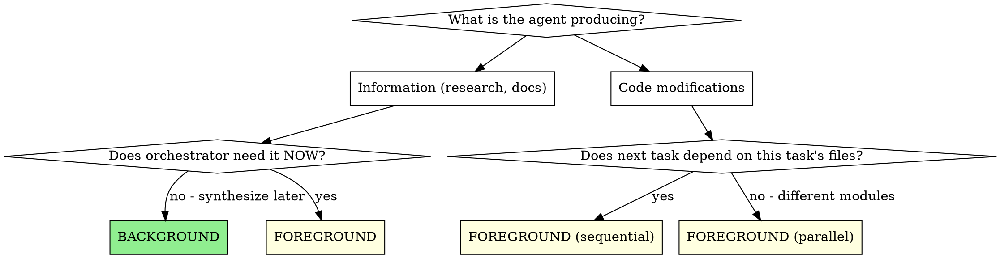

# Multi-Agent Orchestration

**Core principle:**
为任务选择匹配的编排策略，按独立性拆分 agent，提前注入上下文以支持并行，并按信任等级调节评审成本。

## Strategy Selection

```dot
digraph strategy_selection {
    rankdir=TB;
    "What type of work?" [shape=diamond];

    "Research / knowledge gathering" [shape=box];
    "Independent feature builds" [shape=box];
    "Sequential dependent tasks" [shape=box];
    "Same transformation across partitions" [shape=box];
    "Codebase audit / assessment" [shape=box];
    "Greenfield project kickoff" [shape=box];

    "Research Swarm" [shape=box style=filled fillcolor=lightyellow];
    "Epic Parallel Build" [shape=box style=filled fillcolor=lightyellow];
    "Sequential Pipeline" [shape=box style=filled fillcolor=lightyellow];
    "Parallel Sweep" [shape=box style=filled fillcolor=lightyellow];
    "Multi-Dimensional Audit" [shape=box style=filled fillcolor=lightyellow];
    "Full Lifecycle" [shape=box style=filled fillcolor=lightyellow];

    "What type of work?" -> "Research / knowledge gathering";
    "What type of work?" -> "Independent feature builds";
    "What type of work?" -> "Sequential dependent tasks";
    "What type of work?" -> "Same transformation across partitions";
    "What type of work?" -> "Codebase audit / assessment";
    "What type of work?" -> "Greenfield project kickoff";

    "Research / knowledge gathering" -> "Research Swarm";
    "Independent feature builds" -> "Epic Parallel Build";
    "Sequential dependent tasks" -> "Sequential Pipeline";
    "Same transformation across partitions" -> "Parallel Sweep";
    "Codebase audit / assessment" -> "Multi-Dimensional Audit";
    "Greenfield project kickoff" -> "Full Lifecycle";
}
```



| Strategy                    | When                         | Agents    | Background | Key Pattern                                   |
| --------------------------- | ---------------------------- | --------- | ---------- | --------------------------------------------- |
| **Research Swarm**          | 知识收集、文档、SOTA 调研    | 10-60+    | Yes (100%) | 扇出并行，每个 agent 单独成文                 |
| **Epic Parallel Build**     | 已有计划且 feature/epic 独立 | 20-60+    | Yes (90%+) | 按子系统分波次派发                            |
| **Sequential Pipeline**     | 任务存在依赖、共享文件       | 3-15      | No (0%)    | Implement -> Review -> Fix                    |
| **Parallel Sweep**          | 多模块同类改造               | 4-10      | No (0%)    | 按目录分区并行                                |
| **Multi-Dimensional Audit** | 质量闸门、深度评估           | 6-9       | No (0%)    | 同一代码，多视角评审                          |
| **Full Lifecycle**          | 新项目从零开始               | All above | Mixed      | Research -> Plan -> Build -> Review -> Harden |

---

## Strategy 1: Research Swarm

大规模部署 background
agent 建知识语料。每个 agent 研究一个主题并产出一个 markdown 文档。agent 之间零依赖。

### When to Use

- 新项目起步，需要整套技术栈 SOTA 信息
- 构建 skill/plugin，需要完整领域认知
- 技术选型，需要并行比较多个候选

### The Pattern

```
Phase 1: Deploy research army (ALL BACKGROUND)
    Wave 1 (10-20 agents): 核心技术调研
    Wave 2 (10-20 agents): 专题能力、集成方案
    Wave 3 (5-10 agents): 根据早期结果补缺

Phase 2: Monitor and supplement
    - 文档一到就检查
    - 识别空白点，增派定向 agent
    - 把已完成调研结果喂给后续派发

Phase 3: Synthesize
    - 读完全部研究文档 (foreground)
    - 生成架构方案与设计文档
    - 用 Plan agent 汇总结论
```

### Prompt Template: Research Agent

```markdown
Research [TECHNOLOGY] for [PROJECT]'s [USE CASE].

Create a comprehensive research doc at [OUTPUT_PATH]/[filename].md covering:

1. [TECH] 最新版本与关键特性 (搜索 "[TECH] 2026" 或 "[TECH] latest")
2. [与项目直接相关的特性]
3. [另一个关键特性]
4. [与其余技术栈组件的集成模式]
5. [性能特征]
6. [常见坑点与限制]
7. [生产环境最佳实践]
8. [关键模式代码示例]

Include code examples where possible. Use WebSearch and WebFetch to get current docs.
```

**Key rules:**

- 每个 agent 必须给明确输出文件路径
- 提供检索提示："search [TECH] 2026"
- 用 8-12 条编号覆盖项锁定范围
- 该类 agent 全部 background，主题之间无依赖

### Dispatch Cadence

- agent 派发间隔 3-4 秒
- 每波按主题组织 10-20 个 agent
- 波次之间预留 15-25 分钟做 gap analysis

---

## Strategy 2: Epic Parallel Build

并行部署 background
agent 实现独立 feature/epic。每个 agent 负责一个 feature，对应一个目录或模块。两个 agent 绝不改同一批文件。

### When to Use

- 实现计划里有 10+ 个独立任务
- monorepo 且包/模块隔离清晰
- sprint backlog 中 feature 没有重叠

### The Pattern

```
Phase 1: Scout (FOREGROUND)
    - 先派一个 Explore agent 画代码地图
    - 找出依赖链和独立工作流
    - 按子系统分组，规避文件冲突

Phase 2: Deploy build army (ALL BACKGROUND)
    Wave 1: 基础设施 (Redis, DB, auth)
    Wave 2: 后端 API (每个模块独立目录)
    Wave 3: 前端页面 (每个路由独立目录)
    Wave 4: 集成项 (MCP servers, 外部服务)
    Wave 5: DevOps (CI, Docker, deployment)
    Wave 6: 处理评审阶段发现的缺陷

Phase 3: Monitor and coordinate
    - 通过 git status 观察完成情况
    - 处理 git index.lock 竞争 (30+ agents 常见)
    - agent 完成后继续派发剩余任务
    - 使用 TodoWrite 或项目计划文档跟踪；关键决策写入 Hindsight

Phase 4: Review and harden (FOREGROUND)
    - 对完成工作执行 subagent-review
    - 为关键问题派发修复 agent
    - 做集成测试
```

### Prompt Template: Feature Build Agent

```markdown
**Task: [DESCRIPTIVE TITLE]** (task\_[ID])

Work in /path/to/project/[SPECIFIC_DIRECTORY]

## Context

[当前已有内容。引用具体文件、模式、基础设施。] [例如："Redis 可从 `app.state.redis` 访问"，"按
`src/auth/` 的模式实现"]

## Your Job

1. 创建 `src/path/to/module/`，包含：
   - `file.py` -- [说明]
   - `routes.py` -- [说明]
   - `models.py` -- [Schema 定义]

2. 实现要求： [详细规格，可含代码片段、Pydantic models、API 契约]

3. Tests:
   - 创建 `tests/test_module.py`
   - 覆盖：[具体测试场景]

4. Integration:
   - 接入 [主应用入口]
   - 在 [path] 注册路由

## Git

Commit with message: "feat([module]): [description]" Only stage files YOU created. Check
`git status` before committing. Do NOT stage files from other agents.
```

**Key rules:**

- 每个 agent 限定目录边界，禁止重叠
- 给出可复用现有模式，比如 "Follow pattern from X"
- 给出基础设施上下文，比如 "Redis available at X"
- 提示词里写清 Git 卫生规则，尤其 30+ 并行场景
- 任务 ID 用于追踪

### Git Coordination for Parallel Agents

10+ agent 并发时：

1. `index.lock` 竞争是常态，agent 会自动重试
2. 每个 agent 只提交自己修改文件，提示词里必须写明
3. 禁止 `git add .`，只 add 指定文件
4. 定期看 `git log --oneline -20`
5. agent 不执行 push，由 orchestrator 统一处理

---

## Strategy 3: Sequential Pipeline

依赖型任务按顺序执行，并设置评审闸门。每一步都基于前一步输出。

### When to Use

- 任务会改共享文件
- 集成边界工作（JNI bridge、auth chain）
- review 后修复，且修复依赖评审结论
- 复杂 feature 需按顺序落地

### The Pattern

```
For each task:
    1. Dispatch implementer (FOREGROUND)
    2. Dispatch spec reviewer (FOREGROUND)
    3. Dispatch code quality reviewer (FOREGROUND)
    4. 修复发现的问题
    5. 进入下一任务

Trust Gradient (adapt over time):
    Early tasks:  Implement -> Spec Review -> Code Review (full ceremony)
    Middle tasks: Implement -> Spec Review (lighter)
    Late tasks:   Implement only (pattern proven, high confidence)
```

### Trust Gradient

会话推进后，模式稳定，评审负担可逐步下调：

| Phase              | Review Overhead                         | When                        |
| ------------------ | --------------------------------------- | --------------------------- |
| **Full ceremony**  | Implement + Spec Review + Code Review   | 前 3-4 个任务               |
| **Standard**       | Implement + Spec Review                 | 第 5-8 个任务，或模式已稳定 |
| **Light**          | Implement + quick spot-check            | 后段任务，模式已充分验证    |
| **Cost-optimized** | Use the host's configured fast reviewer | 公式化、低风险评审          |

This is NOT cutting corners -- it's earned confidence. If a late task deviates from the pattern,
escalate back to full ceremony.

---

## Strategy 4: Parallel Sweep

把同一种改造应用到代码库分区。每个 agent 做同类型工作，文件集合互斥。

### When to Use

- 多模块 lint/format 修复
- 跨包补充类型标注
- 为多个模块补测试
- 批量更新组件文档
- 多页面 UI 打磨

### The Pattern

```
Phase 1: Analyze the scope
    - 跑工具 (ruff, ty 等) 获取完整问题列表
    - 能自动修复的先自动修复
    - 剩余问题按模块/目录分组

Phase 2: Fan-out fix agents (4-10 agents)
    - 每个模块/目录一个 agent
    - 每个 agent 接收：分类问题数量 + 领域提示
    - 全部 foreground，便于逐个验证完成

Phase 3: Verify and repeat
    - 再次运行工具检查剩余问题
    - 还有问题就发下一波
    - 重复直到清零
```

### Prompt Template: Module Fix Agent

```markdown
Fix all [TOOL] issues in the [MODULE_NAME] directory ([PATH]).

Current issues ([COUNT] total):

- [RULE_CODE]: [description] ([count]) -- [domain-specific fix guidance]
- [RULE_CODE]: [description] ([count]) -- [domain-specific fix guidance]

Run `[TOOL_COMMAND] [PATH]` to see exact issues.

IMPORTANT for [DOMAIN] code: [领域说明，例如 "GTK imports 需要先调用 GI.require_version() 再导入
gi.repository"]

After fixing, run `[TOOL_COMMAND] [PATH]` to verify zero issues remain.
```

**Key rules:**

- 提供按类别统计后的问题数量
- 提供领域规则，明确模式背后原因
- 按目录分区，避免冲突
- 采用波次循环：修复 -> 验证 -> 继续修复 -> 再验证

---

## Strategy 5: Multi-Dimensional Audit

并行部署多个 reviewer，从不同维度审同一份代码。每个 reviewer 一种视角。

### When to Use

- 大功能完成，需要全面评审
- 发版前质量闸门
- 安全审计
- 性能评估

### The Pattern

```
Dispatch 6 parallel reviewers (ALL FOREGROUND):
    1. 代码质量与安全 reviewer
    2. 集成正确性 reviewer
    3. 规格完整性 reviewer
    4. 测试覆盖 reviewer
    5. 性能分析 reviewer
    6. 安全审计 reviewer

Wait for all to complete, then:
    - 汇总发现并形成优先级行动清单
    - 为关键问题派发定向修复 agent
    - 仅对有发现的维度执行复审
```

### Prompt Template: Dimension Reviewer

```markdown
[DIMENSION] review of [COMPONENT] implementation.

**Files to review:**

- [file1.ext]
- [file2.ext]
- [file3.ext]

**Analyze:**

1. [该维度的具体问题]
2. [该维度的具体问题]
3. [该维度的具体问题]

**Report format:**

- Findings: 带严重级别的编号列表 (Critical/Important/Minor)
- Assessment: Approved / Needs Changes
- Recommendations: 按优先级排序的行动项
```

---

## Strategy 6: Full Lifecycle

greenfield 项目可按顺序组合全部策略：

```
Session 1: RESEARCH (Research Swarm)
    -> 30-60 background agents 构建知识语料
    -> 架构规划 agents 汇总调研
    -> 输出：docs/research/*.md + docs/plans/*.md

Session 2: BUILD (Epic Parallel Build)
    -> Scout agent 先画已有结构
    -> 30-60 background agents 按 epic 实现功能
    -> 监控、处理 git 竞争、追踪完成状态
    -> 输出：可运行代码库与提交记录

Session 3: ITERATE (Build-Review-Fix Pipeline)
    -> Code review agents 评审实现
    -> Fix agents 修复问题
    -> Deep audit agents (foreground) 评估各子系统
    -> 输出：完成质量评估的代码库

Session 4: HARDEN (Sequential Pipeline)
    -> 集成边界评审 (foreground, sequential)
    -> 安全修复、竞态修复
    -> 测试基础设施搭建
    -> 输出：生产可用代码库

Session 5: CONSOLIDATE (Dream)
    -> 记录稳定模式、坑点、架构决策
    -> 把稳定模式、坑点、架构决策写入 Hindsight 项目 bank
    -> 输出：可复用长期记忆
```

每个会话都应随工作性质切换策略：能并行就并行，必须串行就串行。

---

## Background vs Foreground Decision



**Rules observed from 597+ dispatches:**

- 无即时依赖的 research agent -> BACKGROUND（100%）
- 写代码 agent -> FOREGROUND（即使并行）
- review/validation 闸门 -> FOREGROUND（会阻塞流水线）
- 顺序依赖任务 -> FOREGROUND，逐个执行

---

## Prompt Engineering Patterns

### Pattern A: Role + Mission + Structure (Research)

```markdown
You are researching [DOMAIN] to create comprehensive documentation for [PROJECT].

Your mission: 为 [TOPIC] 能力写一份完整参考文档。

Cover these areas in depth:

1. **[Category]** -- 具体条目
2. **[Category]** -- 具体条目 ...

Use WebSearch and WebFetch to find blog posts, GitHub repos, and official docs.
```

### Pattern B: Task + Context + Files + Spec (Feature Build)

```markdown
**Task: [TITLE]** (task\_[ID])

Work in /absolute/path/to/[directory]

## Context

[已有内容、必读文件、可用基础设施]

## Your Job

1. Create `path/to/file` with [说明]
2. [详细实现规格]
3. [测试要求]
4. [集成要求]

## Git

Commit with: "feat([scope]): [message]" Only stage YOUR files.
```

### Pattern C: Review + Verify + Report (Audit)

```markdown
Comprehensive audit of [SCOPE] for [DIMENSION].

Look for:

1. [具体检查点 #1]
2. [具体检查点 #2] ...
3. [具体检查点 #10]

[范围边界 -- 哪些目录/文件]

Report format:

- Findings: 编号 + 严重级别
- Assessment: Pass / Needs Work
- Action items: 按优先级排序
```

### Pattern D: Issue + Location + Fix (Bug Fix)

```markdown
**Task:** Fix [ISSUE] -- [SEVERITY]

**Problem:** [含 file:line 的问题描述] **Location:** [精确文件路径]

**Fix Required:**

1. [具体改动]
2. [具体改动]

**Verify:**

1. Run [command] to confirm fix
2. Run tests: [test command]
```

---

## Context Injection: The Parallelism Enabler

并行可行，核心在于 orchestrator 预先注入完整上下文。若上下文不足，agent 先探索，整体就会串行化。

**Always inject:**

- 绝对文件路径（不用相对路径）
- 可复用模式（"Follow pattern from `src/auth/jwt.py`"）
- 可用基础设施（"Redis at `app.state.redis`"）
- 设计语言与规范（"SilkCircuit Neon palette"）
- 工具使用提示（"Use WebSearch to find..."）
- Git 规则（"Only stage YOUR files"）

**For parallel agents, duplicate shared context:**

- 每个 agent prompt 复用同一段共享上下文
- 明确排除项（"11-Hindsight memory is handled by another agent"）
- 共用工具与约束保持同一描述

---

## Monitoring Parallel Agents

运行 10+ background agents 时：

1. 周期检查 `git log --oneline -20`
2. 读取输出文件，用 `tail` 看进度
3. 用 TodoWrite 或项目计划文档记录完成状态；关键发现用中文 retain 到 Hindsight
4. 早期 agent 完成后，识别空白并派补位 agent
5. 遇到 git index.lock 竞争按预期处理，允许自动重试

### Status Report Template

```
## Agent Swarm Status

**[N] agents deployed** | **[M] completed** | **[P] in progress**

### Completed:
- [Agent description] -- [Key result]
- [Agent description] -- [Key result]

### In Progress:
- [Agent description] -- [Status]

### Gaps Identified:
- [Missing area] -- deploying follow-up agent
```

---

## Anti-Patterns

| Anti-Pattern                              | Fix                                       |
| ----------------------------------------- | ----------------------------------------- |
| 派发会改同一文件集的 agents               | 按目录/模块分区；每个 scope 一个 owner    |
| 独立 research agents 放 foreground        | research 放 background，完成后再综合      |
| 给 50 个 agents 一句 "fix everything"     | 每个 agent 给明确范围、问题清单、完成信号 |
| build sprint 省略 scout 阶段              | 先 Explore，明确依赖与文件归属            |
| 后段任务仍保持全量评审仪式                | 模式稳定后应用 trust gradient             |
| 允许 agent 执行 `git add .` 或 `git push` | 每条 build prompt 都写清 Git 卫生规则     |
| 集成代码用 background agents              | 集成改动需显式协调，按顺序控制            |

## Hyperskills Integration

| Skill                    | Use With                | When                        |
| ------------------------ | ----------------------- | --------------------------- |
| `hyperskills-brainstorm` | Full Lifecycle          | 方向开放，先发散            |
| `hyperskills-research`   | Research Swarm          | 决策前做知识收集            |
| `hyperskills-plan`       | Epic Parallel Build     | 把范围转为可并行波次        |
| `hyperskills-implement`  | All build strategies    | 执行与验证主循环            |
| subagent-review          | All strategies          | 集成后独立质量闸门          |
| ~~`security`~~           | Multi-Dimensional Audit | 安全维度评审                |
| ~~`git`~~                | Epic Parallel Build     | 多 agent 暂存、rebase、恢复 |
| `hyperskills-dream`      | Full Lifecycle          | 大批量执行后的经验沉淀      |

## What This Skill is NOT

- Not permission to spawn agents when the host environment forbids it.
- Not a replacement for planning; orchestration executes a task graph.
- Not useful for tiny changes that one agent can finish faster directly.
- Not a way around file ownership; overlapping edits still need sequencing.
