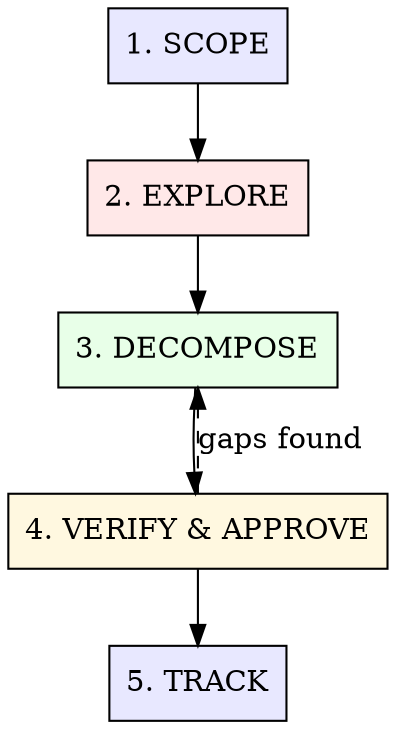

# Structured Planning

以验证为驱动的任务拆解，配合 Hindsight 记忆追踪。内容来自 200+ 次真实规划会话，聚焦那些在代码实践里持续有效的计划模式。

**核心洞察：**步骤一旦缺少可验证检查，计划执行质量就会快速下降。持续拆解，直到每一步都有具体检查方式。把关键决策与计划摘要写入 Hindsight，跨上下文窗口也能持续推进。

## The Process



---

## Phase 1: SCOPE

**先给工作划定边界，再进入探索。**

### Actions

1. **在 Hindsight 搜索**相关决策、历史计划、已知约束：

   ```
   hindsight-embed memory recall default "<feature keywords>"
   hindsight-embed memory recall project-[name] "<feature keywords>"
   ```

   默认查 `default`；项目有独立 bank 时再查 `project-[name]`。

2. **定义成功标准**，明确什么算 done。
   - 可衡量结果（测试通过、接口返回 X、UI 渲染 Y）
   - 目标表达要具体（例如将 "improve performance" 明确为 "p95 latency < 200ms"）

3. **识别约束条件：**
   - 禁止变更的文件/模块
   - 必须遵守的依赖条件
   - 时间或预算因素

4. **判断复杂度等级：**

   | 规模         | 描述                    | 规划深度                 |
   | ------------ | ----------------------- | ------------------------ |
   | **快速修复** | 少于 3 个文件，方案清晰 | 跳到实现                 |
   | **功能**     | 3-10 个文件，模式已知   | 轻量计划（使用本技能）   |
   | **Epic**     | 10+ 个文件，新模式      | 完整计划 + orchestration |
   | **重设计**   | 架构变化                | 完整计划 + 先研究        |

### Gate

当前工作属于 **快速修复** 时，进入实现。5 分钟问题适合完成并验证。

---

## Phase 2: EXPLORE

**先理解代码面，再做任务拆解。**

### Actions

1. **绘制影响面**，明确会触达哪些文件/模块。
   - 范围有不确定性时，启用 Explore/scout agent
   - 基于真实代码阅读判断，避免只看文件名

2. **识别现有模式：**
   - 当前代码库里，相似功能如何实现
   - 现有约定有哪些（命名、目录结构、测试模式）

3. **梳理依赖关系：**
   - 这项工作生效前，哪些条件需要先满足
   - 变更 X 后，哪些位置会受影响

### Output

形成一段关于变更面的心智模型：

```text
这会涉及：[模块 A]（新 endpoint）、[模块 B]（类型变化）、[模块 C]（测试）。模式沿用 [现有功能 X]。依赖 [基础设施 Y] 可用。
```

---

## Phase 3: DECOMPOSE

**把工作拆成可验证步骤。每一步都要有检查方式。**

### The Verification Rule

**步骤缺少验证方式时，这个步骤仍是一个待验证想法。**

每个任务都定义以下字段：

| 字段         | 说明                     |
| ------------ | ------------------------ |
| **任务内容** | 具体实现动作             |
| **文件**     | 需要创建或修改的准确文件 |
| **验证**     | 确认生效的方式           |
| **依赖**     | 必须先完成的任务         |

### Verification Methods

| 方法          | 使用场景                    |
| ------------- | --------------------------- |
| `typecheck`   | 类型变化、接口新增          |
| `test`        | 逻辑、边界情况、集成        |
| `lint`        | 风格、格式、import 顺序     |
| `build`       | 构建系统变化                |
| `visual`      | UI 变化（截图或浏览器检查） |
| `curl/httpie` | API endpoint 变化           |
| `manual`      | 仅在没有自动化方式时使用    |

### Decomposition Heuristics

- **2-5 分钟任务**通常最顺畅。单个任务预计超过 15 分钟时继续拆小。
- **每个任务只处理一个关注点。**
- **按依赖顺序排任务。**先打基础层。
- **标记可并行任务。**无共享文件的任务可以同时进行。

### Task Format

```markdown
## Task [N]: [Imperative title]

**文件：** `src/path/file.ts`, `tests/path/file.test.ts` **依赖：** 任务 [M] **并行：**
是/否（可与任务 [X] 同时执行）

### Implementation

[2-4 条说明，描述要做什么]

### Verify

- [ ] `pnpm typecheck` 通过
- [ ] `pnpm test -- file.test.ts` 通过
- [ ] [关于行为的具体验证断言]
```

### Parallelizability Markers

为可并行执行步骤加标记，便于 orchestration：

```
Wave 1（基础）：  任务 1、任务 2  [可并行]
Wave 2（核心）：  任务 3、任务 4  [可并行，依赖 Wave 1]
Wave 3（集成）：  任务 5          [串行，依赖 Wave 2]
Wave 4（收尾）：  任务 6、任务 7  [可并行，依赖 Wave 3]
```

---

## Phase 4: VERIFY & APPROVE

**执行前先评审计划。**

### Self-Check

向用户展示前，先完成以下检查：

- [ ] 每个任务都具备验证方式
- [ ] 依赖关系构成 DAG（无循环）
- [ ] 并行任务之间无共享修改文件
- [ ] 总体范围符合最初成功标准
- [ ] 方案复杂度符合 YAGNI

### Present for Approval

按 wave 结构展示计划：

```markdown
## Plan: [Feature Name]

**成功标准：** [可衡量结果] **任务预估：** [N] 个任务，分布在 [M] 个 wave **可并行度：**
[X]% 的任务可并行执行

### Wave 1: Foundation

- [ ] 任务 1：[标题] → 验证：[方式]
- [ ] 任务 2：[标题] → 验证：[方式]

### Wave 2: Core Implementation

- [ ] 任务 3：[标题] → 验证：[方式]（依赖：1）
- [ ] 任务 4：[标题] → 验证：[方式]（依赖：2）

### Wave 3: Integration

- [ ] 任务 5：[标题] → 验证：[方式]（依赖：3、4）
```

### Gap Analysis

展示后，主动核对这三项：

- "这个计划有没有遗漏？"
- "这些任务是否需要合并，或继续拆小？"
- "成功标准是否准确？"

---

## Phase 5: TRACK

**把计划摘要和关键决策写入 Hindsight，保证可持续追踪。**

### Actions

1. **记录计划摘要：**

   ```
   hindsight-embed memory retain project-[name] "计划：[功能]。成功标准：[成功标准]。共 [N] 个任务，分布在 [M] 个 wave。关键路径：[关键路径]。"
   ```

2. **记录关键决策与约束：**

   ```
   hindsight-embed memory retain project-[name] "计划决策：[功能]。关键决策：[架构选择]。约束：[约束]。验证方式：[验证方式]。"
   ```

   写入内容必须使用中文；没有项目独立 bank 时使用 `default`。

### Adaptive Replanning

计划与现实接触后会动态变化。某个任务出现超预期复杂度时：

1. 暂停并重新评估。
2. 更新计划，增删改任务。
3. 用新的中文 `retain` 记录计划调整。
4. 对齐沟通，例如："任务 3 暴露了 [X]。计划调整为：[调整内容]。"

---

## Execution Handoff

计划获批后，按场景交接到对应工具：

| 场景                      | 交接方式                               |
| ------------------------- | -------------------------------------- |
| 3-5 个简单任务，用户在场  | 带验证门槛执行                         |
| 5-15 个任务，包含混合并行 | `/hyperskills-orchestrate` + wave 策略 |
| 大型 epic，15+ 个任务     | Orchestrate + Epic Parallel Build 策略 |
| 需要先做更多研究          | 执行前先用 `/hyperskills-research`     |

### Trust Gradient for Execution

| 阶段         | 评审级别                         | 使用时机                  |
| ------------ | -------------------------------- | ------------------------- |
| **完整流程** | 实现 + spec review + code review | 前 3-4 个任务             |
| **标准流程** | 实现 + spec review               | 第 5-8 个任务，模式已稳定 |
| **轻量流程** | 实现 + 快速验证                  | 后期任务，模式已建立      |

这表示逐步积累的执行信心。

---

## Anti-Patterns

| 反模式                   | 处理方式                       |
| ------------------------ | ------------------------------ |
| 为 5 分钟修复写计划      | 完成实现并验证                 |
| 任务缺少验证方式         | 添加具体检查，或拆小任务       |
| 并行任务触达同一批文件   | 调整为串行，或重新划分文件归属 |
| 只看文件名就开始规划     | 拆解前阅读真实代码路径         |
| 把第一版计划当成固定方案 | 新约束出现后更新计划           |

---

## What This Skill is NOT

- **Not required for simple tasks.** If the solution is obvious, just build it.
- **Not a design doc generator.** Plans are action lists, not architecture documents.
- **Not a blocker.** If the user says "just start building," start building. You can plan in
  parallel.
- **Not rigid.** Plans adapt. The first plan is a hypothesis.
