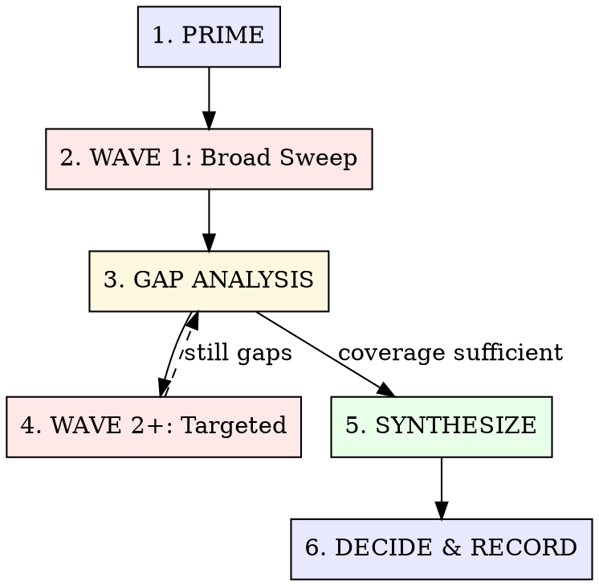

# Multi-Agent Research

**Core insight:**
先横向铺开，再统一综合。先看到 3 个结果就下结论，质量会明显下降。按波次派发 agent，累计证据，再基于全景作判断。

## The Process



---

## Phase 1: PRIME

**派发第一个 agent 前，先查你已经掌握的内容。**

### Actions

1. **先搜 Hindsight：**

   ```
   hindsight-embed memory recall default "<research topic>"
   hindsight-embed memory recall project-[name] "<related technology>"
   hindsight-embed memory recall project-[name] "<prior decision in this area>"
   ```

   默认查 `default`；项目有独立 bank 时再查 `project-[name]`。

2. **检查知识是否过期：**
   - Hindsight 里有 3 个月前记录，且主题变化快（framework、model、cloud
     service）时，继续 research，同时把旧信息作为基线
   - Hindsight 里有近期记录时，先展示已有结论，再判断是否需要深挖

3. **把研究问题写清楚：**
   - 示例（模糊）："research databases"
   - 示例（清晰）："compare PostgreSQL vs CockroachDB for multi-region write-heavy workloads with
     <10ms p99 latency requirement"

4. **设置 research 预算：**

   | Depth          | Agents | Time      | When                       |
   | -------------- | ------ | --------- | -------------------------- |
   | **Quick scan** | 2-3    | 2-5 min   | 领域熟悉，只补最新信息     |
   | **Standard**   | 5-10   | 10-15 min | 技术选型、架构对比         |
   | **Deep dive**  | 10-30  | 20-40 min | greenfield 决策、SOTA 分析 |
   | **Exhaustive** | 30-60+ | 40-90 min | 新项目起步、竞品全景       |

### Source Quality Contract

| Claim Type              | Required Source                                  |
| ----------------------- | ------------------------------------------------ |
| Current version         | 包注册表、release 页面、官方 CLI                 |
| CLI flags / config keys | 官方文档或本地 `--help` 输出                     |
| Security frameworks     | OWASP, NIST, SLSA/OpenSSF, CIS, ISO, PCI sources |
| Cloud/provider behavior | 厂商官方文档 + 最新 changelog                    |
| Research papers / SOTA  | 论文、benchmark repo、作者产物                   |
| Community health        | 仓库活跃度 + issue/release 频率                  |

当主源与博客冲突时，记录冲突并以主源为准。事实有时效性时，标注日期，优先给可复跑命令或可复查来源。

---

## Phase 2: WAVE 1 — Broad Sweep

**第一波 agent 覆盖完整研究面。**

### Agent Design Principles

每个 agent 需要：

- **单一具体主题**（避免 "research everything about X"）
- **明确输出路径**（写到哪里一眼可见）
- **搜索提示**（带年份，如 "search [topic] 2026"）
- **8-12 条编号覆盖项**（范围可控）
- **来源质量要求**（"prefer official docs and GitHub repos over blog posts"）

### Wave 1 Template

```markdown
Research [SPECIFIC_TOPIC] for [PROJECT/DECISION].

Create a research doc at docs/research/[filename].md covering:

1. 当前状态（最新版本、最近变更）
2. [与场景相关能力 A]
3. [能力 B]
4. [与当前技术栈集成：列出具体技术]
5. 性能特征 / benchmarks
6. 已知限制与坑点
7. 社区健康度（stars、活跃度、维护情况）
8. 与替代方案比较（指明 2-3 个候选）

Use WebSearch for current information. Include dates on all facts. Cite sources with URLs.
```

### Deployment Rules

- **Wave 1 全部 background**，相互无依赖
- **派发间隔 3-4 秒**，减少限流
- **每个 agent 写独立文件**，避免共享输出
- **按主题分组**，12 个主题可拆成 3-4 个簇

### Coverage Strategy

技术选型建议覆盖：

| Dimension       | Question               |
| --------------- | ---------------------- |
| **Capability**  | 是否满足需求能力边界   |
| **Performance** | 性能是否达标           |
| **Ecosystem**   | 是否能融入当前技术栈   |
| **Maturity**    | 生产可用程度如何       |
| **Community**   | 两年后是否持续维护     |
| **Cost**        | 目标规模下成本如何     |
| **Migration**   | 采用与迁移的复杂度如何 |

---

## Phase 3: GAP ANALYSIS

**Wave 1 完成后先补缺，再做综合。**

### Actions

1. **读取全部 Wave 1 输出**，逐篇快速扫描
2. **识别缺口：**
   - 哪些维度缺失
   - 哪些结论互相冲突
   - 提了问题但没有答案的点
   - 缺少哪些关键比较

3. **检查偏差：**
   - 结论全是正面信号，质量可疑，补失败案例
   - 只有官方文档，补社区与生产经验
   - 多篇复用同一来源，补来源多样性

### Decision Point

| Finding              | Action                          |
| -------------------- | ------------------------------- |
| 覆盖较好，仅少量缺口 | 开始综合，同时记录缺口          |
| 存在明显缺口         | 派发 Wave 2 定向 research agent |
| 结论冲突             | 派发验证 agent 解决冲突         |
| 发现新方向           | 按新方向执行 Wave 2             |

---

## Phase 4: WAVE 2+ — Targeted Research

**针对 gap analysis 的缺口做定向补强。**

### Wave 2 Agents Are Different

- **范围更小**，每个 agent 只答一个问题
- **质量要求更高**，要求生产经验报告，而非只抄文档
- **交叉验证**，例如 "Agent X 提到 [claim]，请用 [alternative source] 验证"
- **深度阅读**，要求读完整 README 与 API docs，而非只看落地页

### When to Stop

满足以下条件即可收束波次：

- 研究问题已可高置信回答
- 新增 agent 进入边际收益下降区间
- 关键结论有 >= 2 个独立来源
- 用户已给出 "enough, let's decide"

**多数研究最多 3 波。** 三波后仍不清晰，先重构问题定义。

---

## Phase 5: SYNTHESIZE

**把所有发现组合成可执行结论。价值集中在这一阶段。**

### Synthesis Structure

```markdown
## Research: [Topic]

### TL;DR

[2-3 句。先给答案。]

### Recommendation

[给明确选择和依据。]

### Options Evaluated

| Option | Fit | Maturity | Perf | Ecosystem | Verdict         |
| ------ | --- | -------- | ---- | --------- | --------------- |
| A      | ... | ...      | ...  | ...       | Best for [X]    |
| B      | ... | ...      | ...  | ...       | Best for [Y]    |
| C      | ... | ...      | ...  | ...       | Avoid: [reason] |

### Key Findings

1. [最关键发现 + 来源]
2. [第二关键发现]
3. [第三关键发现]

### Risks & Gotchas

- [已知限制]
- [迁移复杂点]
- [隐性成本]

### Sources

- [Source 1](url) — [贡献点]
- [Source 2](url) — [贡献点]
```

### Synthesis Rules

1. **推荐优先。** 阅读者先看到结论，再看证据细节。
2. **事实与观点分层。** 事实可核查，观点需要证据链。
3. **保留反向证据。** 证据冲突时写清缘由。
4. **所有事实带日期。** 例如 "As of Feb 2026..."。
5. **标注置信度。** 例如 "High confidence" 或 "Low confidence"。

---

## Phase 6: DECIDE & RECORD

**做决策并沉淀到长期记忆。**

### Actions

1. **向用户展示综合结果**，给清晰推荐

2. **记录到 Hindsight：**

   ```
   hindsight-embed memory retain project-[name] "研究：[主题]。评估选项：[候选项]。选择：[X]。原因：[理由]。关键风险：[Y]。主要来源：[URL]。日期：[today]。"
   ```

   写入内容必须使用中文；没有项目独立 bank 时使用 `default`。

3. **归档 research 文档**，保留波次输出用于追溯：
   - 项目内：`docs/research/[topic]/`
   - 通用知识：记录到 `default` bank 即可

4. **进入下一动作：**

   | Next Step                  | When                      |
   | -------------------------- | ------------------------- |
   | `/hyperskills-brainstorm`  | 研究后出现多个可行方向    |
   | `/hyperskills-plan`        | 决策已定，进入实施拆解    |
   | `/hyperskills-orchestrate` | 决策已定，工作可并行推进  |
   | Direct implementation      | research 确认路径足够简单 |

---

## Quick Research Mode

适合聚焦问题，省略完整波次协议：

1. 搜 Hindsight（固定第一步）
2. 做 2-3 次定向检索（WebSearch + WebFetch）
3. 直接内联综合结论（无需单独文档）
4. 对非显而易见结论用中文写入 Hindsight

**Use when:** "What's the latest version of X?", "Does Y support Z?", "What's the recommended way to
do W?"

---

## Research Patterns by Type

### Technology Evaluation

```
Wave 1: 每个候选并行读取官方文档 + GitHub README
Wave 2: 并行补充生产经验 + benchmarks
Synthesize: 对比矩阵 + 推荐结论
```

### Codebase Archaeology

```
Wave 1: Explore agents 并行绘制各子系统结构
Wave 2: 并行 grep 指定模式与调用路径
Synthesize: 架构图 + 依赖关系图
```

### SOTA Analysis

```
Wave 1: 并行 WebSearch 最新论文、博客、发布信息
Wave 2: 并行深读最相关 3-5 个来源
Synthesize: 提炼真正新内容 + 推荐
```

### Competitive Landscape

```
Wave 1: 并行整理每个竞品 feature matrix
Wave 2: 并行分析定价、社区体量、演进趋势
Synthesize: 定位矩阵 + gap analysis
```

---

## Anti-Patterns

| Anti-Pattern                            | Fix                                   |
| --------------------------------------- | ------------------------------------- |
| Wave 1 后直接综合                       | 先做 gap analysis，结论更完整         |
| 50 个 agents 全写 "research everything" | 每个 agent 定义具体范围，提示词具体化 |
| 仅依赖官方文档                          | 同步补社区经验，现实反馈更关键        |
| 发现中无日期                            | 所有发现标注日期，避免信息过期误导    |
| 没有推荐结论                            | 给明确决策，必要时同时给条件边界      |
| 重复研究 Hindsight 已掌握内容           | PRIME 阶段先检索，减少重复开销        |

---

## What This Skill is NOT

- **Not a substitute for reading code.** If the answer is in the codebase, read the codebase.
- **Not an infinite loop.** Max 3 waves. If that's not enough, reframe the question.
- **Not required for known domains.** If you already know the answer, just say so and cite your
  knowledge.
- **Not a delay tactic.** Research serves a decision. If no decision follows, the research was
  waste.
